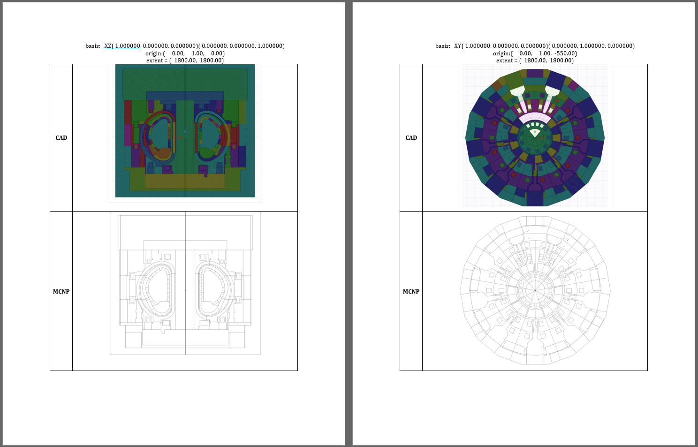

# CAD to MCNP comparison
These tools are used to automatically produce reports that show the differences between a CAD document and its associated MCNP input file.


The plots' specifications are defined in the `plot_instructions.txt` file which is made up of the MCNP plotter commands. 

Example of the contents of the `plot_instructions.txt`:

```
plot
label 0 0 &
pz 0 ex 1000
ex 500
basis 0 1 0 -33 0 26 &
ex 1000
px 1 ex 1000
end
end
```

## How to use
### 1. Define the plot instructions
Prepare the `plot_instructions.txt` file. Every line represents a plot unless the last character is `&` which represents a continuation line. It is recommended to inlcude the `label 0 0` to avoid the display of cell and surface numbers in the MCNP plotter.

### 2. Run the MCNP plotter job
Generate a `RUNTPE` file if no one is yet available by doing a NPS=1 MCNP simulation or similar. Then run a `NOTEK` plot job with a command similar to:

`mcnp5.mpi z r=runtpe_file notek com=plot_instructions.txt n=plot. eol > plot.dump`

This job will produce a file named `plotm.ps`. Convert it to PDF and save it with the name `plotm.pdf` in the same folder as these scripts.

### 3. Produce the CAD plots
Open in SpaceClaim the CAD file. Drag the `slice_plot.py` script into the screen and run it. Make sure that the same `plot_instructions.txt` file used in the MCNP plots is present in the same folder as the CAD file.

This will generate a set of JPG files, one for each plot. Place those files in the same folder as these scripts.

### 4. Combine the plots into a report
Place in the same folder:
1. The `combine_plots.py` script.
2. The `plotm.pdf` file.
3. All the JPG files generated by SpaceClaim.
4. The `TEMPLATE.docx` file.

Run `combine_plots.py`. This will generate the `result.docx` file.

## Known issues
If the plot instructions includes plots with a slicing plane that is not parallel to the coordinate axis by means of the `basis vec1 vec2` command, the SpaceClaim plot will be correct but it may be rotated. This can be easily fixed by manually rotating the SpaceClaim plot image in the final `result.docx` file.