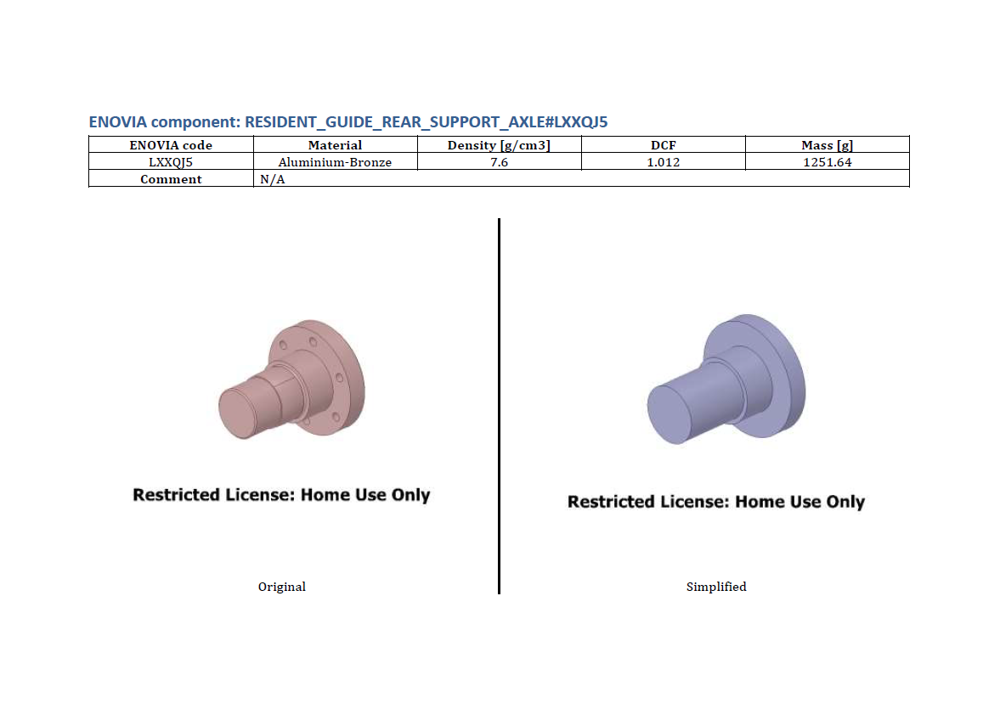

# Report generation
These tools are used to automatically produce a report that compares images of the original and simplified CAD geometry of SpaceClaim documents. 

# How to use
## 1. Run the csv_generator.py on the original geometry
These scripts make use of the CSV file.

## 2. Run the make_picutres.py script on the original CAD file
This will create a folder named *_Original_Pictures* and fill it with a picture for each row of the CSV file of the document.

## 3. Update the CSV with information on the simplified geometry
These scripts will make use of information found in the _Material_, _Density_, _DCF_, _Mass_ and _Comment_ columns.

## 4. Run the make_pictures.py on the simplified CAD file
This will create a folder named *Simplified_Pictures* and fill it with pictures.

## 5. Run the report_generation.py script
This will generate a docx file with the report.

## 6. Final touches to the report
Open the docx file with Word and set the layout to horizontal. Then save it as a PDF file.

# Issues
These scripts are designed to work with CAD files that follow the ENOVIA code convention (a # and six alphanumeric characters at the end of every component name). It may not work properly with generic CAD files. It could be updated to use the last version of the Componen class as seen in the current csv_generator.py script.
